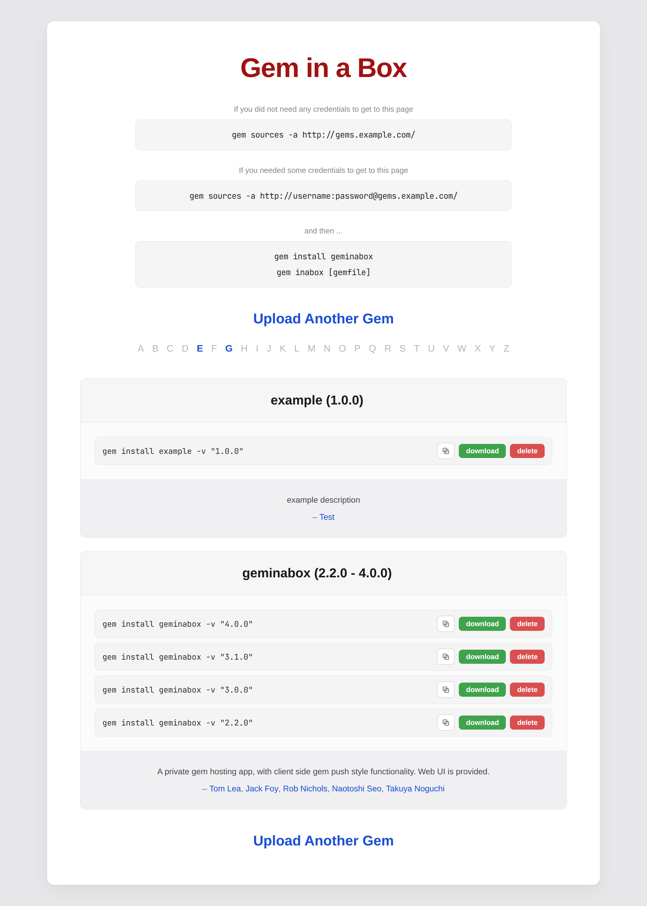

[](https://github.com/geminabox)

# Gem in a Box – Really simple rubygem hosting

[](https://github.com/geminabox/geminabox/actions/workflows/ruby.yml?query=branch%3Amaster)
[](http://badge.fury.io/rb/geminabox)
Geminabox lets you host your own gems, and push new gems to it just like with rubygems.org.
Bundler finds your gems through the [compact index](#compact-index), with no client configuration.
Authentication is left up to either the web server, or the Rack stack.
For basic auth, try [Rack::Auth::Basic](https://rubydoc.info/gems/rack/Rack/Auth/Basic).



## System Requirements

- Ruby 3.0 or later (Ruby 3.2+ recommended)
- RubyGems 3.2.3 or later (latest version recommended)

## Server Setup

    gem install geminabox rackup webrick

`rackup` and a Rack server are separate gems on Ruby 3.0+ with Rack 3.
WEBrick is used here; any Rack server works.

Create a config.ru as follows:

    require "rubygems"
    require "geminabox"

    Geminabox.data = "/var/geminabox-data" # ... or wherever

    # Use Rack::Protection to prevent XSS and CSRF vulnerability if your geminabox server is open public.
    # Rack::Protection requires a session middleware, choose your favorite one such as Rack::Session::Memcache.
    # This example uses Rack::Session::Pool for simplicity, but please note that:
    # 1) Rack::Session::Pool is not available for multiprocess servers such as unicorn
    # 2) Rack::Session::Pool causes memory leak (it does not expire stored `@pool` hash)
    use Rack::Session::Pool, expire_after: 1000 # sec
    use Rack::Protection

    run Geminabox::Server

Start your gem server with `rackup`, or hook up the config.ru as you normally would ([passenger](https://www.phusionpassenger.com/), [puma](https://puma.io/), [unicorn](https://yhbt.net/unicorn/), whatever floats your boat).

## Using Geminabox alongside rubygems.org

Geminabox serves only the gems you push to it. To use it together with
rubygems.org, declare it as a scoped source in your Gemfile so that every gem
is pinned to exactly one source:

```ruby
source "https://rubygems.org"

source "https://gems.example.com" do
  gem "internal-widgets"
  gem "internal-tools"
end
```

This pinning is Bundler's protection against dependency confusion: a gem name
that exists on both servers can never silently resolve to the wrong one.

### RubyGems proxy (removed in 4.0)

Earlier versions of Geminabox could proxy rubygems.org and serve remote and
local gems from one merged namespace. The feature was deprecated in 3.1.0 and
removed in 4.0:

- It relied on the RubyGems.org Dependency API
  (`/api/v1/dependencies`), which was
  [sunset on 2023-05-24](https://blog.rubygems.org/2023/02/22/dependency-api-deprecation.html),
  so the proxy had not worked for years.
- Serving remote and local gems from one namespace invites dependency
  confusion attacks and defeats Bundler's source pinning described above.

When upgrading, remove `Geminabox.rubygems_proxy` and its related settings
(`rubygems_proxy_merge_strategy`, `allow_remote_failure`, `ruby_gems_url`,
`bundler_ruby_gems_url`) from your config.ru, and point your Gemfile at
rubygems.org directly with a scoped source block as shown above. Leftover
settings won't break your server: 4.0 warns about each one and ignores it,
and the `RUBYGEMS_PROXY` and `RUBYGEMS_PROXY_MERGE_STRATEGY` environment
variables get the same startup warning. These shims go away in 5.0.

If you need a caching or mirroring proxy for rubygems.org (air-gapped
networks, bandwidth, protection against upstream yanks), use
[gemstash](https://github.com/rubygems/gemstash), maintained by the RubyGems
organization.

## Compact index

Geminabox serves the [compact index API](https://guides.rubygems.org/rubygems-org-compact-index-api/)
(`/versions`, `/info/GEMNAME`, `/names`). Bundler 1.12+ detects and uses it
automatically; no client configuration is needed. Responses support
`If-None-Match` and ranged requests, so `bundle install` only downloads
index data that changed since the last run.

The materialized index lives in `data/compact_index/` and is updated
whenever gems are added or removed. Deleting that directory (or hitting
`/reindex`) is safe; it is rebuilt from the stored gems on the next request.

On installs upgraded from an earlier version with many stored gems, the
first request to `/versions` builds the index and can take a while as it
checksums every stored gem, so hitting `/reindex` or `/versions` right
after upgrading avoids surprising the first `bundle install`.

### Running behind a reverse proxy

A stock nginx or Passenger deployment needs no special configuration for the
compact index. gzip is safe to leave on, even for `text/plain`: Bundler sends
its ranged requests without `Accept-Encoding`, and nginx never compresses 206
responses, so 304 revalidation and ranged tail appends keep working.

Two things do interfere:

- Proxy-level caching of `/versions`, `/info/*`, or `/names` (nginx
  `proxy_cache`, or a CDN). The files reference each other by checksum, so a
  cache serving one fresh and another stale makes Bundler report checksum
  mismatches. Bundler already caches and revalidates client-side; leave these
  paths uncached.
- Middleware or middleboxes that strip or rewrite headers. Removing `ETag`
  disables 304 revalidation; removing `Repr-Digest`/`Digest` makes Bundler
  refuse to append partial responses and re-download the full file after
  every change.

### Replacing a published version

`gem inabox -o` (and the `allow_replace` server option) overwrites a stored
gem in place: same version number, different contents. Geminabox updates the
compact index to match, including the new checksum. Bundler, however, guards
against a version's bytes changing.

Since 2.5, Bundler records each gem's checksum in the `CHECKSUMS` section of
`Gemfile.lock`. On a later resolve it compares the checksum the server now
advertises against the locked one, and if they differ for the same name and
version it aborts with `Bundler::ChecksumMismatchError`, treating the change as
a possible supply-chain swap. Nothing on the server can override this; the
conflict is between the client's lockfile and the replaced contents.

An overwrite is therefore transparent only to consumers who have not locked
that version yet. Anyone whose `Gemfile.lock` already pins it hits the error on
their next `bundle install` or `bundle update`. Their options are to remove
that gem's line from `CHECKSUMS`, delete the lockfile and re-resolve, or turn
off the check with `bundle config set --local disable_checksum_validation true`.
The clean fix is to bump the version instead of replacing it; treat `-o` as a
convenience for a private box whose gems nobody has locked yet.

## HTTP client

The Geminabox server makes no outbound HTTP requests. The `gem inabox`
client uploads gems with the [HTTPClient](https://github.com/nahi/httpclient)
gem, which honors the `http_proxy` / `HTTP_PROXY` environment variables.

If you drive `GeminaboxClient` from Ruby (a Rake task, say), you can configure
its HTTP layer through `Geminabox.http_adapter` before creating the client:

```ruby
require "geminabox"
require "geminabox_client"

# Geminabox.http_adapter = Geminabox::HttpClientAdapter.new # default
Geminabox.http_adapter.http_client = HTTPClient.new.tap do |http_client|
  http_client.keep_alive_timeout = 32 # sec
end

GeminaboxClient.new("https://gems.example.com").push("pkg/my-gem-1.0.0.gem")
```

To use a different HTTP library, subclass `Geminabox::HttpAdapter` and
implement `post` and `set_auth` (the client's upload path), plus `get` and
`get_content` for completeness. `Geminabox::TemplateFaradayAdapter` is a
worked example.

    Geminabox.http_adapter = YourHttpAdapter.new

## Hooks

You can add a hook (anything callable) which will be called when a gem is
successfully received.

```ruby
Geminabox.on_gem_received = Proc.new do |gem|
  puts "Gem received: #{gem.spec.name} #{gem.spec.version}"
end
```

Typically you might use this to push a notification to your team chat. Any
exceptions raised within the hook are silently ignored, so handle them
yourself if that is not what you want.

Also, please note that this hook blocks `POST /upload` and `POST /api/v1/gems` APIs processing.
Hook authors are responsible for making slow work non-blocking/async to avoid HTTP timeouts.

## Client Usage

Geminabox supports the standard gemcutter push API:

    gem push pkg/my-awesome-gem-1.0.gem --host HOST

You can also use the gem plugin:

    gem install geminabox

    gem inabox pkg/my-awesome-gem-1.0.gem

And the standard gemcutter yank API:

    gem yank my-awesome-gem -v 1.0 --host HOST

Configure Gem in a box (interactive prompt to specify where to upload to):

    gem inabox -c

Change the host to upload to:

    gem inabox -g HOST

Simples!

## Command Line Help

    Usage: gem inabox GEM [options]

      Options:
        -c, --configure                  Configure GemInABox
        -g, --host HOST                  Host to upload to.
        -o, --overwrite                  Overwrite Gem.
        -p, --port                       Sets port


      Common Options:
        -h, --help                       Get help on this command
        -V, --[no-]verbose               Set the verbose level of output
        -q, --quiet                      Silence command progress meter
            --silent                     Silence RubyGems output
            --config-file FILE           Use this config file instead of default
            --backtrace                  Show stack backtrace on errors
            --debug                      Turn on Ruby debugging
            --norc                       Avoid loading any .gemrc file


      Arguments:
        GEM       built gem to push up

      Summary:
        Push a gem up to your GemInABox

      Description:
        Push a gem up to your GemInABox

## Docker

Using Gem in a Box is really simple with the Dockerfile.  Move this Dockerfile into a directory that you want to use for your server.

That directory only needs to contain:

```
config.ru
Gemfile
Gemfile.lock
```

Use the config.ru from [Server Setup](#server-setup), with the data directory
set to the path the image prepares for it (the container runs as a non-root
user and cannot create directories elsewhere):

```ruby
Geminabox.data = "/usr/src/app/data"
```

Your Gemfile only needs:

```ruby
source 'https://rubygems.org'

gem 'geminabox'
gem 'rackup'
gem 'webrick' # or other server you prefer
```

From there

```
docker build -t geminabox .
```

```
docker run -d -p 9292:9292 -v geminabox-data:/usr/src/app/data geminabox:latest
```

Your server should now be running! The `geminabox-data` volume keeps your
gems when the container is replaced; without it they are lost.


## Running the tests

Running `rake` runs the unit, request, and integration tests.
`rake test:conformance` runs the RubyGems compact-index conformance suite
separately. See [CONTRIBUTING.md](./CONTRIBUTING.md) for the full set of checks
CI runs.

The test suite uses
[minitest-reporters](https://github.com/minitest-reporters/minitest-reporters)
with the default reporter. To get more detailed test output, use `rake
MINITEST_REPORTER=SpecReporter`. With this setting, output of the Geminabox
server that is started for integration tests is sent to `stdout` as well.

## Licence

[MIT_LICENSE](./MIT-LICENSE)

## ChangeLog

[CHANGELOG.md](./CHANGELOG.md)
